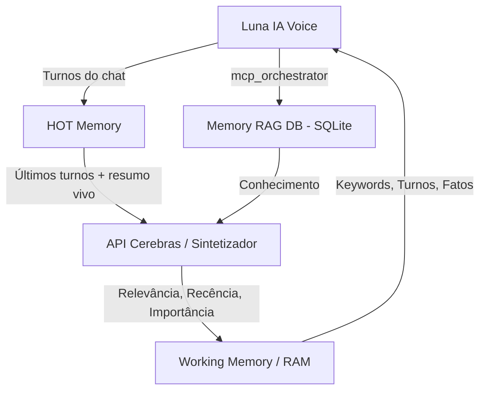

# Luna Voice: Arquitetura de Memória 3-Tier (Cognitive Memory System)

Este documento documenta o design arquitetural do sistema de memória da Luna IA, focado em resolver o problema de "memória de galinha" sem estourar o limite de contexto e mantendo a latência baixa.

## O Desafio
Em chats por voz contínuos (como o Gemini Live), o payload (tamanho da mensagem) cresce a cada turno, e as IAs tendem a esquecer regras ou fatos passados se o contexto não for rigorosamente curado. Injetar o banco de dados inteiro no prompt é impossível e lento.

## Arquitetura: 3 Camadas de Memória

A solução é um pipeline de 3 camadas assíncronas operado por um modelo ultra-rápido (Llama via Cerebras API) atuando como "Sintetizador de Memória".

### 1. HOT Memory (Atenção Imediata)
- **O que é:** O buffer de curto prazo.
- **Conteúdo:** Os últimos turnos do chat e um resumo vivo (live summary) da sessão atual.
- **Fluxo:** Cada vez que a Luna fala ou o usuário fala, o turno entra na HOT Memory.

### 2. Working Memory (Memória RAM)
- **O que é:** O contexto ativamente carregado na "cabeça" da Luna.
- **Conteúdo:** Fatos relevantes, preferências do usuário, palavras-chave e contexto vital para o momento atual.
- **Como é gerado:** O orquestrador usa a **API da Cerebras (inferência ultra-rápida)** para ler a HOT Memory e a RAG DB, filtrando o que importa usando 3 pilares: **Relevância + Recência + Importância**.
- **Injeção:** A Working Memory é a única coisa (além do prompt do sistema) injetada no contexto do Gemini Live.

### 3. Memory RAG DB (Conhecimento Profundo / Long Term)
- **O que é:** O banco de dados vetorial/SQLite persistente.
- **Conteúdo:** Histórico de longo prazo, notas, logs antigos, aprendizados sobre o usuário.
- **Acesso Ativo:** A Luna pode usar o `mcp_orchestrator` para fazer buscas explícitas (Ex: "Deixe-me pesquisar nos meus arquivos o que você me disse ontem...").
- **Acesso Passivo:** A API da Cerebras puxa blocos relevantes da RAG DB para compor a Working Memory em background.

## Diagrama de Fluxo de Dados

## Benefícios do Design
- **Velocidade:** A Luna (Voz) interage instantaneamente porque seu contexto é minúsculo (apenas a RAM).
- **Inteligência de Fundo:** A API da Cerebras (Llama 3 ultra-rápido) pensa, analisa e resume o contexto em paralelo, enquanto o usuário fala, preparando a RAM para o próximo turno.
- **Zero Alucinação:** Fatos não são esquecidos porque a RAG DB alimenta constantemente a RAM sempre que o tópico muda.
